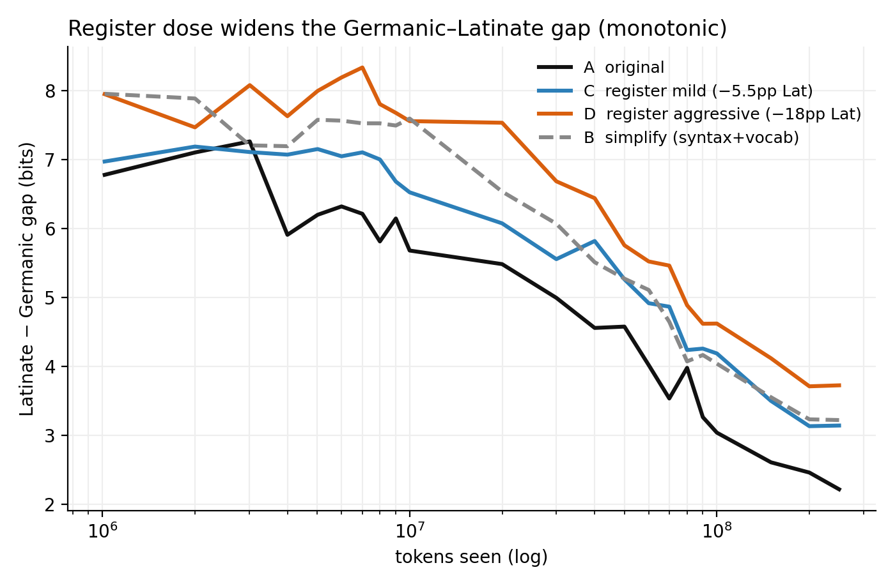

# Register simplification and age-of-acquisition on the BabyLM 2026 corpus

Does lowering the **register/complexity** of the hardest text in a small pretraining corpus improve
sample-efficient learning? This repo tests that on the [BabyLM 2026](https://babylm.github.io/)
Strict-Small track (English, ~10M words) with a controlled A/B/C/D design where **only the register of
the ~2.9% highest-complexity lines differs** between arms.

**Headline finding — the two evaluation axes dissociate:**

- **Grammar (BLiMP): flat.** Lowering register buys no sample efficiency; the register dose-response is
  flat (A 65.2, and the treatments land ~1–1.5 pt below baseline with no trend across dose).
- **Lexical acquisition (AoA): a clean, monotonic dose-response.** Tracking per-word surprisal across
  training on 67 matched Latinate/Germanic synonym pairs, the more Latinate vocabulary a corpus strips,
  the worse the model learns those words — final Latinate−Germanic gap **A 2.22 < C (−5.5pp) 3.14 <
  D (−18pp) 3.73 bits**, while Germanic words are unaffected.

So the manipulation *provably* reshapes what the model learns at the vocabulary level; it just does not
transfer to grammatical benefit. See [`docs/register/register-simplification-results.md`](docs/register/register-simplification-results.md)
and [`results/register/aoa/ANALYSIS.md`](results/register/aoa/ANALYSIS.md) for the full write-ups.



## The arms

Every arm starts from the same corpus; only the rewrite applied to the selected high-complexity lines
differs (base reconstruction is byte-identical across arms).

| Arm | Rewrite of the selected lines |
|---|---|
| A original | none (baseline corpus) |
| B simplify | syntax + vocabulary → child-directed English |
| C register (mild) | vocabulary only: Latinate → plain, structure/length fixed (−5.5pp Latinate) |
| D register (aggressive) | vocabulary only, pushed hard (−18pp Latinate) |

## Repository layout

The repo is organized **by front** — each contributor's work lives under a same-named subfolder within
each top-level directory, so fronts stay isolated. This is the `register` front:

```
src/babylm_2026/register/   etymology labeller (Germanic vs Latinate) + register probe
scripts/register/           select → rewrite → assemble → measure → train → eval → AoA-harvest → plot
notebooks/register/         exploratory analysis (corpus baseline, confound checks, swap dictionary)
docs/register/              final results write-up
results/register/aoa/       per-checkpoint surprisal CSVs, AoA figures, ANALYSIS.md
figures/register/           generated figures
```

Shared across fronts: `babylm-eval/` (official eval pipeline, git submodule), `scripts/evaluate.sh`
and the `Makefile` that drives it, and [`docs/eval.md`](docs/eval.md).

`data/`, `models/`, `checkpoints/`, weights, and `results/raw/` are gitignored — large artefacts stay
off the repo.

## Setup

```bash
git clone --recursive https://github.com/pambhar-deepkumar/babylm-2026.git
cd babylm-2026
python -m venv .venv && source .venv/bin/activate
make setup
```

`make setup` initialises the eval submodule and installs all requirements. If you cloned without
`--recursive`, just run `make setup` — it handles the submodule.

## Data

The corpus is **not redistributed here** — obtain it from HuggingFace:
[`BabyLM-community/BabyLM-2026-Strict-Small`](https://huggingface.co/datasets/BabyLM-community/BabyLM-2026-Strict-Small),
and place the English strict-small `.train` file at `data/bb26_en.train`.

## Evaluation

Checkpoints are scored with the official BabyLM 2026 pipeline, vendored as a git submodule at
`babylm-eval/` and pinned to a commit so runs stay comparable:

```bash
make eval MODEL=<hf_id_or_local_path> BACKEND=causal
```

The arms here are GPT-2, hence `BACKEND=causal`. See [`docs/eval.md`](docs/eval.md) for the other
backends and for how to bump the pinned eval version.

## Reproduce

The rewrite step calls an LLM (Llama-3.3-70B via OpenRouter, ~$1.5 for the full corpus); the API key is
read from the OS keychain at runtime and is never stored in the repo.

```bash
# 1. select the high-complexity lines to rewrite
python scripts/register/build_manifest.py
# 2. rewrite them (--variant simplify = Arm B, register = Arm C/D)
python scripts/register/rewrite_corpus.py --variant register
# 3. assemble the arm corpus (base reconstruction is checksum-verified against the original)
python scripts/register/make_simplified_corpus.py --variant register
# 4. manipulation check (readability + Latinate-share shift)
python scripts/register/measure_simplification.py
# 5. train an arm from scratch (official 2026 GPT-2 recipe); train_traj.slurm adds AoA checkpoints
python scripts/register/train_gpt2.py --train_file data/bb26_register.train --output_dir output/arm_c ...
# 6. evaluate (BLiMP headline)
make eval MODEL=output/arm_c BACKEND=causal
# 7. AoA: build the fixed probe set, harvest per-checkpoint surprisal, plot
python scripts/register/build_aoa_probes.py --corpus data/bb26_en.train --k 30
python scripts/register/harvest_surprisal.py --arm_dir output/traj_c --arm_name C --out results/register/aoa/traj_c_surprisal.csv
python scripts/register/plot_aoa.py --indir results/register/aoa --outdir figures/register
```

`scripts/register/*.slurm` are example [LRZ](https://doku.lrz.de/) job configs; adapt the partitions and
environment to your cluster.

## License

MIT — see [LICENSE](LICENSE).

## Acknowledgments

This is the data/register contribution of a three-person BabyLM 2026 group project (TUM LLM Practical
Course). Alessio Piroli led the model/architecture front and Nour Hadjfredj the tokenizer front;
this repository covers the corpus register-simplification and age-of-acquisition analysis.
